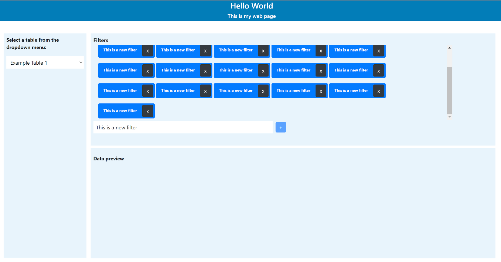
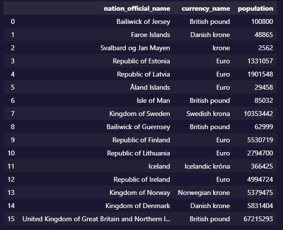
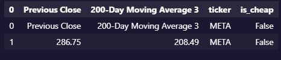
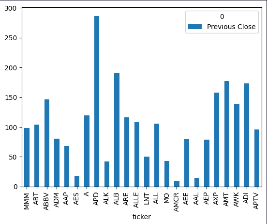

# Dell Challenge

[Original challenge specification document](SE%20Challenge_24_08_2023.docx.pdf)

## Exercise 1

**Languages**: HTML, CSS, JavaScript

Create a Web Page that looks as similar as possible to the screenshot below.\
It should be possible to add a new Filter element in the “Filters” section, using the text input field and the  button.\
When the filter elements are too many, a scrollbar will appear on the right side.\
You can also delete each Filter element by clicking the  button next to them.\
You can use HTML, CSS, vanilla JavaScript, jQuery, Bootstrap or any other styling library and framework.



### Solution

The complete solution can be found in the [ex1/ directory](ex1/).

### Questions

1. How would you deploy this web page so that users can access it online? Talk about the infrastructure, the resources, and the technologies needed.\
   **This webpage is designed for deployment on static website hosting. Since we don't rely on server-side rendering technologies like PHP, JSP, or Node.js, hosting it on a Content Delivery Network (CDN) is sufficient. The CDN serves static files to clients with the necessary headers. Any dynamic content is fetched through API calls from the client.**

   **However, it's important to note that we don't include file content hashes in our filenames. This limits our ability to implement strong, long-term caching on the client side. To mitigate this, depending on the hosting service, we can configure cache headers using techniques like ETags or last modified dates. This ensures that clients may still make requests for content, but the server can choose to respond with a 'not modified' status and let the client use its locally cached version.**

   **For improved overall page load performance and SEO, we could consider server-side rendering for dynamic content, along with the use of a bundler to add content hashes to static filenames. However, implementing these enhancements would also require a more robust infrastructure capable of running a web server with technologies like Node.js or PHP.**

2. How would you modify the code in order to populate the dropdown menu with values coming from a database? Talk about possible database solutions, and how the backend can interact with the frontend.\
   **To populate the dropdown with values from a database, we could add a REST API call, using the Fetch API or XMLHttpRequest (like the Axios library does) in the `loadTableList` function. We would also need to handle HTTP errors and loading state to provide a better user experience. And, of course, we would need a backend server for the REST API.**

   **Example:**

   ```js
   // index.js > loadTableList [Line 36]

   // Load available table names
   setTableLoading(true);
   const $options = await fetch("/api/tables")
     .then((res) => res.json())
     .then((data) => {
       return data.map((item) => {
         const $option = $("<option></option>");
         $option.attr("value", item.id);
         $option.text(item.name);

         return $option;
       });
     })
     .catch((err) => {
       // Display a friendly error message instead of a simple alert
       alert("Error loading table list");
       throw err;
     })
     .finally(() => {
       setTableLoading(false);
     });
   ```

   **There are several database solutions available, each being suitable to specific requirements and data characteristics. For structured data with a well-defined schema that can be neatly organized into tables with rows and columns, we could use relational databases like PostgreSQL and MySQL. These are particularly suitable when complex queries involving multiple relationships between tables are necessary.**

   **On the other hand, if the data is unstructured or semi-structured (e.g., JSON or XML) and its structure changes frequently, or if we need horizontal scaling to handle high data volume and traffic, non-relational databases (NoSQL) like MongoDB or DynamoDB provide the flexibility required. In some cases, we could also use both SQL and NoSQL databases together, or use JSON columns in relational databases such as PostgreSQL to merge unstructured data.**

   **The backend can interact with the frontend in various ways, depending on the application's requirements. The most common method is through HTTP calls, enabling data querying and manipulation via a REST API. This approach can be complemented with server-side rendering, where dynamic content is pre-rendered in HTML. We can also use technologies like GraphQL for flexible data querying or WebSockets for real-time communication.**

   **In the case of this web page, as it is a static website and does not have server-side rendering, we can use a REST or GraphQL API to load and manipulate the data, and if the exchange of information in real time is necessary, we could use WebSocket because the WebSocket client runs in the browser via JavaScript. But we would need another server to serve as the backend for our web page, and that server would require a more robust infrastructure to implement a REST or GraphQL API, as well as a WebSocket server to handle client connections if necessary.**

## Exercise 2

**Languages**: Python

Use the following public REST API.\
https://restcountries.com/

Get data only for Northern European countries, and filter only for the following fields:\
`name`\
`currencies`\
`population`

The API call should be asynchronous and encapsulated in a function.

Load the JSON response into a dictionary and then turn it into a single index Pandas dataframe.\
The columns should be `nation_official_name`, `currency_name` and `population`.

The dataframe should look like this:



then connect to a hypothetical Postgres Database and load the dataframe to a new table, in REPLACE mode.

### Solution

The complete solution can be found in the [ex2/ directory](ex2/).

### Questions

1. If you didn’t know the structure of the JSON, and there was an arbitrary level of nesting of arrays and dictionaries, how would you need to change the code to dynamically unnest the data into a single-indexed dataframe?\
   **ANSWER**

2. If you had to scale this application to read and load data for hundreds of countries and refresh the database every few minutes, what strategies could be used in terms of coding patterns, technologies, resources and infrastructure?\
   **ANSWER**

## Exercise 3

**Languages**: Python

Scrape the S&P 500 companies table from the following Wikipedia page:\
https://en.wikipedia.org/wiki/List_of_S%26P_500_companies

Save the companies ticker symbols into a list. Cut the list to take only the first 50 elements.

For each ticker symbol in the list, call the following API In order to get the Previous Close value for each company:\
https://finance.yahoo.com/quote/AAPL?p=AAPLtsrc=fin-srch\
Save this value and the ticker symbol in a Pandas dataframe.

For each ticker symbol also call the following API endpoint in order to get the 200-Day Moving Average value:\
https://finance.yahoo.com/quote/AAPL/key-statistics?p=AAPL
Save this value in a new column of the same dataframe.

Compute a new column in the dataframe called `is_cheap` with a Boolean value which is True if the Previous Close is lower than the 200-Day Moving Average and False otherwise.

Example:



Concatenate all dataframes for all ticker symbols in one.

Display the dataframe on a plot only for the companies where is_cheap = True.
On the X axis should be the Ticker symbol and on the Y axis the Previous Close value.



### Solution

The complete solution can be found in the [ex3/ directory](ex3/).

### Questions

1. If the Wikipedia table was lazy loaded, and only appeared after a few seconds from opening the page, what libraries and strategies could you adopt to get the data?\
   **ANSWER**

2. If you had to run this script for thousands of companies instead of 500, what kind of patterns, libraries and/or optimization techniques could you use to keep the process efficient?\
   **ANSWER**
